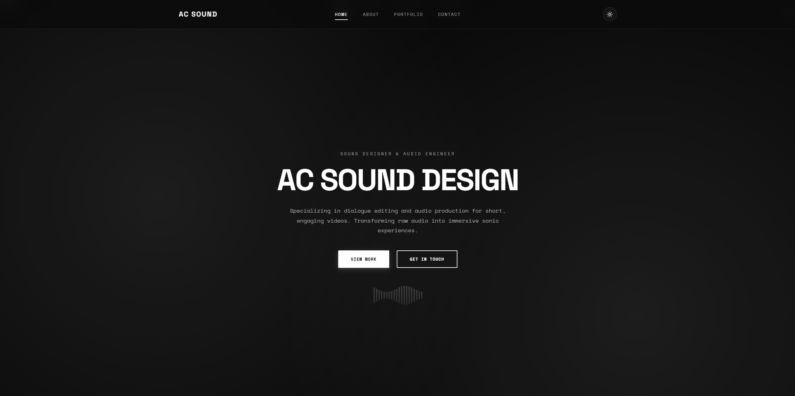

# AC Sound Design — Portfolio Website


[](https://github.com/tyler-bravin/AC-Sound-Design/blob/master/LICENSE)

Portfolio website for **Andrew Clelland** (AC Sound Design), sound designer — built with **React** and **Vite**. Monochrome, audio-inspired design: Space Grotesk + Space Mono type system, an animated waveform hero, and a dark/light theme toggle. Projects open in rich modals supporting showreels, embedded game builds, photo galleries, and downloadable builds.

<br>



---

### ✨ Key Features
* **Audio-Inspired Design**: A monochrome aesthetic with an animated waveform hero — built for a sound designer, styled like one.
* **Dynamic Theme Switching**: Toggle between dark and light modes across the entire site, modals included.
* **Multi-Format Project Modals**: Each project opens in a modal supporting its media type — YouTube showreels, embedded Unity WebGL builds playable in the browser, keyboard-navigable photo galleries, or downloadable Windows/Mac builds.
* **Playable Game Builds**: The Wildfire game jam entry and Honours research project run directly in the page via WebGL.
* **Mobile Carousel**: On smaller screens the project grid becomes a swipeable carousel with dot navigation.
* **Data-Driven Content**: All projects, skills, and contact details live in a single data file — no component changes needed to update the site.
* **Responsive Design**: Layout adapts from desktop grid to mobile carousel seamlessly.
* **Reduced-Motion Support**: Respects the user's `prefers-reduced-motion` setting.

---

### 💻 Technologies Used
* **Frontend**: React 18, HTML5, CSS3, JavaScript
* **Build Tooling**: Vite
* **Styling & Theming**: CSS Custom Properties (Variables), Responsive CSS
* **Icons**: `lucide-react`
* **Fonts**: Google Fonts (Space Grotesk, Space Mono)
* **Embedded Content**: Unity WebGL, YouTube embeds

---

### 🛠️ Installation & Setup

Follow these steps to get a local copy of the project up and running.

1.  **Clone the repository:**
    ```bash
    git clone https://github.com/tyler-bravin/AC-Sound-Design.git
    cd AC-Sound-Design
    ```

2.  **Install dependencies:**
    ```bash
    npm install
    ```

3.  **Start the development server:**
    ```bash
    npm run dev
    ```
    The application will now be running on `http://localhost:3000`.

4.  **Build for production:**
    ```bash
    npm run build
    ```
    The optimised output is written to `dist/`, and `npm run preview` serves it locally.

---

### 📝 Editing Content

All content lives in **`src/data/portfolio.js`** — no component changes needed:

* **Projects** — the `projects` array. Each entry supports one media type: `videoUrl` (YouTube embed), `gameUrl` (embedded WebGL build), `isGallery` + `galleryImages`, or `downloads` (build zips). Set `image` to a screenshot path, or `null` to show the animated waveform placeholder.
* **Toolkit** — the `skillGroups` array (grouped tags).
* **Contact & bio** — `contactInfo` and `aboutText`.

Static assets (images, CV, game builds) go in `public/` and are referenced with root paths like `/images/example.webp`.

---

### 🚀 Deployment

Any static host works — build with `npm run build` and serve the **`dist/`** folder.

* **Netlify / Vercel**: connect the repo; build command `npm run build`, publish directory `dist`. Both handle SPA routing automatically.
* **Plain hosting (cPanel etc.)**: upload the contents of `dist/` to the web root, and add an `.htaccess` rewrite so refreshes don't 404:
    ```apache
    <IfModule mod_rewrite.c>
      RewriteEngine On
      RewriteCond %{REQUEST_FILENAME} !-f
      RewriteCond %{REQUEST_FILENAME} !-d
      RewriteRule . /index.html [L]
    </IfModule>
    ```

> **Note:** The repo carries large assets (Unity WebGL builds in `public/`) — keep hosting bandwidth and storage limits in mind.

---

### 🤝 Credits

* **Design & Development**: [Tyler Bravin](https://tylerbravin.dev)
* **Icons**: [Lucide](https://lucide.dev/)
* **Fonts**: [Google Fonts](https://fonts.google.com/) (Space Grotesk, Space Mono)

### 📜 License
The source code is licensed under the MIT License — see the `LICENSE` file for details.
All portfolio content (audio, video, images, photography, CV, and game builds) is **© Andrew Clelland, all rights reserved**, and is not covered by the MIT license.
